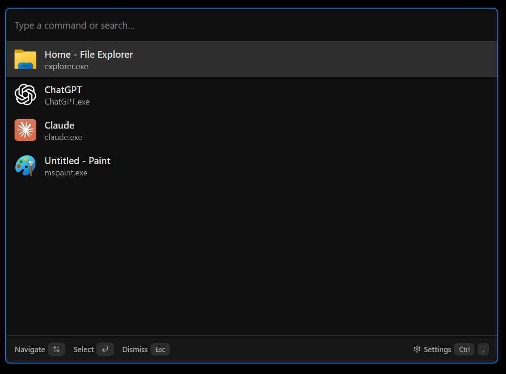
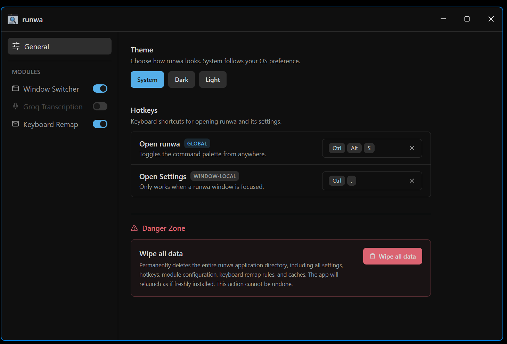

# runwa

A cross-platform (Win & Mac) command palette launcher inspired by [PowerToys Command Palette](https://learn.microsoft.com/en-us/windows/powertoys/command-palette/overview). Invoke with a global hotkey, fuzzy-search anything, extend via pluggable modules.



<details>
<summary>More screenshots</summary>



</details>

## Features

**Shipped:**

- **Window Switcher** — list and focus any open window. Rust napi-rs addon over Win32 on Windows, CoreGraphics/AX on macOS, `osascript` fallback. Uses the window's own icon (WM_GETICON / class) before falling back to the exe icon — correct for UWP/PWA/shared-exe apps.
- **Groq Transcription** — push-to-talk or toggle voice-to-text via Groq Whisper. Direct-launch hotkey captures mic audio, transcribes, and drops the result on the clipboard (optional auto-paste).
- **Keyboard Remap** — low-level, system-wide remap layer. CapsLock → Ctrl (tap = Escape), Space → modifier layer (tap = space). YAML rules file, cross-platform (Windows hook, macOS CGEventTap, Linux uinput). Covers the AutoHotkey / Karabiner-Elements basics.
- **Settings UI** — per-module toggles, config fields, hotkey rebinding.
- **Hotkey system** — global activation chord (default `Super+Alt+Space`) plus per-module direct-launch hotkeys.
- **Module registry** — prefix routing, request cancellation, firewalled providers.

## Tech stack

Electron 41 · React 19 · TypeScript (strict) · Vite · Tailwind CSS v4 · Zustand · Fuse.js · Rust (napi-rs native addon)

## Getting started

```bash
npm install
npm run build:native   # compile the Rust native addon
npm run dev
```

Requires a stable Rust toolchain for the `native/` crate.

## Building

```bash
npm run dist:win    # Windows installer
npm run dist:mac    # macOS dmg
npm run dist:linux  # Linux AppImage
```
