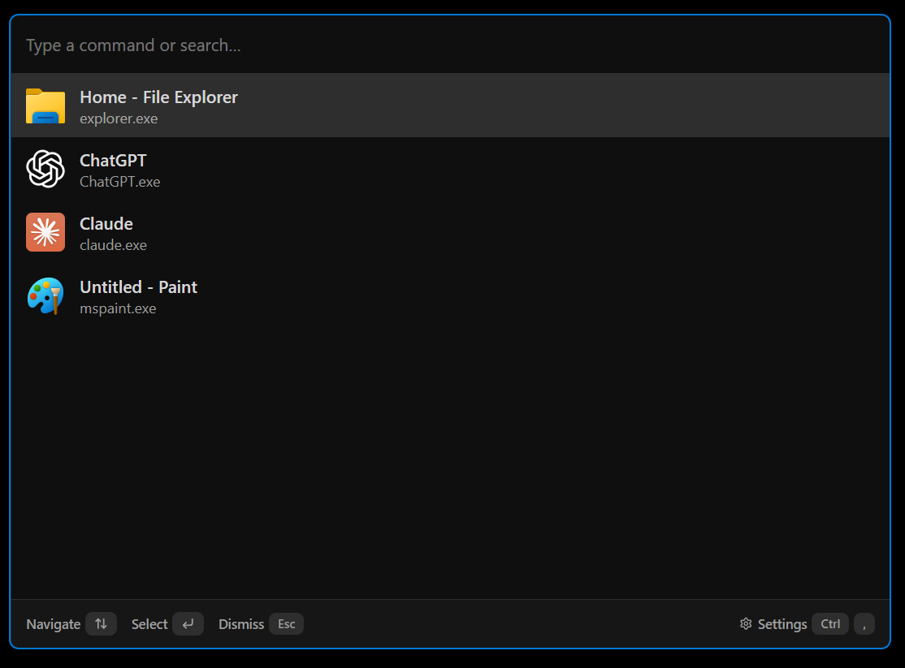
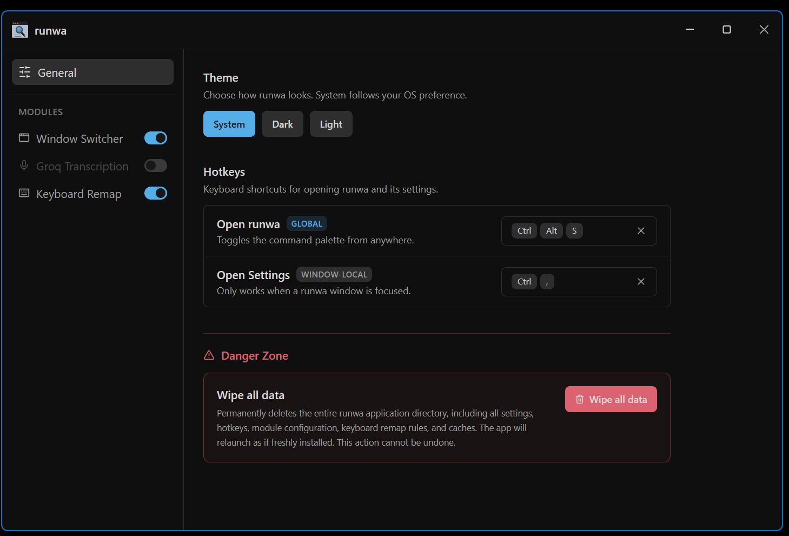

# runwa

A cross-platform (Win & Mac) command palette launcher inspired by [PowerToys Command Palette](https://learn.microsoft.com/en-us/windows/powertoys/command-palette/overview). Invoke with a global hotkey, fuzzy-search anything, extend via pluggable modules.



<details>
<summary>More screenshots</summary>



</details>

## Features

**Shipped:**

- **Window Switcher** — list and focus any open window. Rust napi-rs addon over Win32 on Windows, CoreGraphics/AX on macOS, `osascript` fallback. Uses the window's own icon (WM_GETICON / class) before falling back to the exe icon — correct for UWP/PWA/shared-exe apps. Double-press of the hotkey jumps straight to the previous window (Alt+Tab-style, works across windows of the same app); Ctrl/Cmd+D closes the highlighted window without leaving the list.
- **Groq Transcription** — push-to-talk or toggle voice-to-text via Groq Whisper. Direct-launch hotkey captures mic audio, transcribes, and drops the result on the clipboard (optional auto-paste).
- **Keyboard Remap** — low-level, system-wide remap layer. CapsLock → Ctrl (tap = Escape), Space → modifier layer (tap = space). YAML rules file, cross-platform (Windows hook, macOS CGEventTap, Linux uinput). Covers the AutoHotkey / Karabiner-Elements basics.
- **Auto Dark Mode** — switch the Windows or macOS system appearance manually or on a two-time local schedule. Includes `Themes on Schedule` and `Toggle Theme` commands.
- **Desktop Hint** — shared, focusless status popup with native-inspired light and dark styling, used by Hotstrings, transcription, and Auto Dark Mode.
- **User Commands** — add named actions under Settings → Other and run them from Command Palette. Shell actions support scripts, environment expansion, pipelines, and launching apps with arguments; keystroke actions press a shortcut in the app you were just in. Each command is global or scoped to one application, in which case it is only listed while that app is focused — so per-app commands (and their aliases) never collide. Includes removable platform-specific examples on first use.
- **Settings UI** — per-module toggles, config fields, hotkey rebinding.
- **Hotkey system** — per-module direct-launch hotkeys; each module's palette is reachable via its own configurable chord.
- **Module registry** — prefix routing, request cancellation, firewalled providers.

## User commands

Open **Settings → Other → User Commands**, give the command a display name,
and pick what it does. Saved entries appear in the existing Command Palette
immediately.

**Shell commands** take a command line in your operating system's shell syntax:

```text
# macOS
open -a "Visual Studio Code" --args --new-window

# Windows
"C:\Program Files\My App\app.exe" --profile work

# Linux
/path/to/script.sh --profile work
```

They run detached from the user's home folder through `/bin/sh` on macOS /
Linux or `cmd.exe` on Windows. Their output is not captured. They inherit
runwa's permissions, including elevation when **Run as administrator** is
enabled, so only save commands you trust.

**Keystroke commands** take a shortcut instead, and press it in the window you
were in before opening the palette — handy for shortcuts that are awkward to
type or that you can never remember. Steps are separated by commas:

```text
Ctrl+Alt+L          # reformat code in IntelliJ IDEA
Alt+Space, R        # open the system menu, then Restore
CmdOrCtrl+Shift+P   # resolved to Cmd on macOS, Ctrl elsewhere
```

Sending keys uses the same native hook as Hotstrings, so macOS needs
Accessibility permission (Settings → General → Permissions).

### Per-application commands

Leave **Applies to** empty and the command is global — always in the list.
Name an app there and the command is listed *only* while that app is the one
you came from:

```text
idea64.exe          # Windows: process name
IntelliJ IDEA       # macOS: app name
*idea*              # either, via a wildcard
```

The scope is matched against the focused app's process name, executable or
bundle path, using the same `*` wildcards as the Window Switcher ignore list.
The picker next to the field lists the apps you currently have open, so you
don't have to guess how the OS spells them.

App-scoped rows carry a chip on the right naming the app they belong to —
they sit in the ordinary **User Commands** list rather than a section of
their own.

You don't have to go to Settings to add one. While you're in the app itself,
open Command Palette and run **Create user command for <app>** at the bottom
of the User Commands list: a small form asks for the name, the type, and the
action, and the app scope is filled in from whatever you were just in. The
new command lands selected in the list, ready to run with Enter.

User commands are ordinary palette rows, so they take the palette's existing
**alias** flow: highlight one, press <kbd>Ctrl</kbd>+<kbd>K</kbd> → *Set
alias…*, and typing that alias runs the command straight away. Aliases are
stored per command and only matched among the commands currently in scope, so
`b` can mean "Build" in IntelliJ, something else in VS Code, and something else
again globally — app-scoped commands win over a global one sharing the same
alias. Settings shows each command's alias read-only, next to its name.

Existing commands can be edited in place from Settings (the pencil button):
name, type, action, and app scope. The command keeps its identity, so its
alias stays attached — unlike deleting and re-adding it.

## Tech stack

Electron 41 · React 19 · TypeScript (strict) · Vite · Tailwind CSS v4 · Zustand · Fuse.js · Rust (napi-rs native addon)

## Getting started

```bash
npm install
npm run build:native   # compile the Rust native addon
npm run dev
```

Requires a stable Rust toolchain for the `native/` crate.

## Building

```bash
npm run dist:win    # Windows installer
npm run dist:mac    # macOS dmg
npm run dist:linux  # Linux AppImage
```
